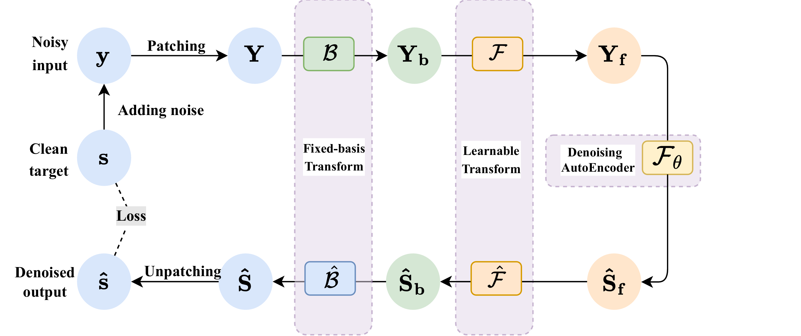

# DeepSparser

**DeepSparser: Structured Dual-Sparse Learning for Efficient Seismic Denoising**

DeepSparser is an end-to-end framework for efficient seismic denoising that combines a fixed-basis transform, a learnable adaptive transform, and a lightweight denoising autoencoder within a unified cascaded architecture.

## Highlights

- **Structured dual-sparse framework**: A fixed-basis transform provides an initial sparse representation, a learnable transform refines it in a data-adaptive feature domain, and a lightweight denoising autoencoder suppresses residual noise.
- **Efficient model design**: Only 0.43M parameters and 24.49M FLOPs per forward pass.
- **Fast inference**: Processes 24-hour continuous 100 Hz seismic recordings in 9.6 s on a single NVIDIA 2080Ti GPU.
- **Strong denoising performance**: Improves output SNR by 9.3 dB over DeepDenoiser and 5.6 dB over DeepSeg on the synthetic benchmark.

## Method Overview

Below is the overall architecture of DeepSparser:



The framework first patchifies the noisy input, projects it into a fixed-basis sparse domain, refines the representation through a learnable transform, and then suppresses residual noise with a lightweight denoising autoencoder. The denoised representation is finally reconstructed back to the signal domain.


## Project Structure

```text
DeepSparser/
├── model/
│   └── network.py              # DeepSparser and denoising autoencoder definition
├── dataset/
│   ├── dataset_synthetic.py    # Synthetic wavelet dataset
│   └── dataset_real.py         # Real STEAD seismic dataset
├── config/
│   ├── config_synthetic.yaml   # Hyperparameters for synthetic experiments
│   └── config_real.yaml        # Hyperparameters for real-data experiments
├── train.py                    # Training script
├── inference.py                # Inference and visualization script
├── download_data.py            # Dataset download utility
├── utils.py                    # Utility functions and config loader
├── demo_synthetic.ipynb        # Interactive demo on synthetic data
├── demo_real.ipynb             # Interactive demo on real data
└── requirements.txt
```

## Installation

```bash
git clone https://github.com/jatq/DeepSparser_python.git
cd DeepSparser_python
pip install -r requirements.txt
```

**Requirements**: Python ≥ 3.8, PyTorch ≥ 1.10, CUDA (optional, for GPU acceleration).

## Quick Start

### 1. Download Data

```bash
python download_data.py
```

If automatic download fails (Gitee redirect), manually download from [https://gitee.com/jatq33/data/tree/master/dataset/](https://gitee.com/jatq33/data/tree/master/dataset/) and place files into `dataset/real/` and `dataset/synthetic/`.

### 2. Train

```bash
# Synthetic wavelet experiment
python train.py --config config/config_synthetic.yaml

# Real seismic data (STEAD) experiment
python train.py --config config/config_real.yaml
```

Training skips automatically if a checkpoint already exists at the configured path.

### 3. Inference

```bash
# Synthetic: visualize denoising on test samples 10, 20, 30
python inference.py --config config/config_synthetic.yaml --indices 10 20 30

# Real data: visualize denoising on test samples 0-4
python inference.py --config config/config_real.yaml --indices 0 1 2 3 4
```

### 4. Interactive Demos

We provide two Jupyter Notebook demos for quick exploration:

- **`demo_synthetic.ipynb`** — Train and visualize denoising on synthetic wavelet signals.
- **`demo_real.ipynb`** — Train and visualize denoising on real STEAD seismic data.

Open them in Jupyter Notebook or JupyterLab and run all cells:

```bash
jupyter notebook demo_synthetic.ipynb
jupyter notebook demo_real.ipynb
```

## Method Overview

```
Noisy signal y
    │
    ▼
┌─────────────────────┐
│  Patching (overlap)  │   y → Y ∈ R^{N×K}
└─────────┬───────────┘
          ▼
┌─────────────────────┐
│  Fixed-basis DCT B  │   Y_b = B · Y
└─────────┬───────────┘
          ▼
┌─────────────────────┐
│  Learnable W₁       │   Y_f = W₁ · Y_b
└─────────┬───────────┘
          ▼
┌─────────────────────┐
│  Denoising AE F_θ   │   Ŝ_f = F_θ(Y_f)
└─────────┬───────────┘
          ▼
┌─────────────────────┐
│  Learnable W₂       │   Ŝ_b = W₂ · Ŝ_f
└─────────┬───────────┘
          ▼
┌─────────────────────┐
│  Fixed-basis Bᵀ     │   Ŝ = Bᵀ · Ŝ_b
└─────────┬───────────┘
          ▼
┌─────────────────────┐
│  Unpatching (avg)    │   ŝ = Unpatch(Ŝ)
└─────────────────────┘
```

The loss function combines L₁ reconstruction loss and inverse-consistency regularization:

```
L = L_rec + λ · L_reg
```
